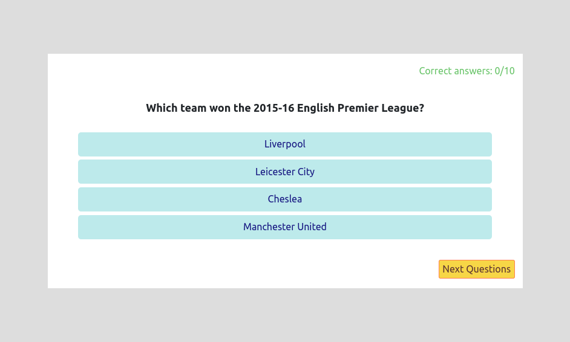
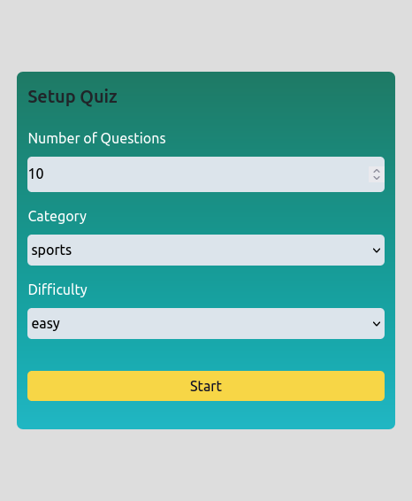

# Quiz App

Sideland : **## Quiz Application**

> ### Overview :

- Test your knowledges about history, sports, politics and discover if you are a track or become one of them.
- Quiz application helps to entertain while recalling your knowledges. This small app is an educational game good for everyone.

## Interest

You might be interested on how:

- **Trivia API** , the api used in our project to fetch questions and answers. Here is the link to the documentation api :
- [https://opentdb.com/api_config.php](https://opentdb.com/api_config.php)

- or **useContext Hook** , essentials to learn about the feature...

### Links

- Solution URL: [https://github.com/BeinRain06/quiz-app.git](https://github.com/BeinRain06/quiz-app.git)
- Live Site URL: [https://beinrain06.github.io/quiz-app/](https://beinrain06.github.io/quiz-app/)

## Description : \* challenge issue

**usecontext Hook**

> I review `usecontext hook`.It was once again challenging like i didn't get well the concept first when i learned and implemented it.
>
> **analyzing**

1. **identify clicked button in unordered list react**
   >

- i got a hard time when trying to perform a **single action** with the unordered list of button located in my `QueueItem.jsx` file. I was using _useState Hook_ but i still go throuh the fact when clicking **one** `button` of my **list** it end up showing the value of all the answer containe in all other **li** of the list. But my goal was each `button` clicked has just the duty to **show** the answer to the question contained in his **li** not to the others.
  >
- i **finally** figure out that if i create a new property inside my **resumeArray** called `showed`. I can set it to `false` initially and when my **button** in the **li** will be **clicked** i change the value of `showed` to be the opposite of what it was `!item.showed` then i could make a targeted response encompasses in my **li** rendering
  >
- we could check these following line of code to see what precisely we are talking about :
- ### AppContext.jsx file
- `const queryBox = questions.find((item, index) => index === indexTarget);
        setResumeArray(() => [
          ...resumeArray,
          (resumeArray[indexTarget] = {
            id: indexTarget + 1,
            question: queryBox.question,
            answer: queryBox.correct_answer,
            right: false,
**here** ->   showed: false,
          }),
        ]);`

- ### QueueItem.jsx file
- const handleShowAnswer = () => {
  setAnswer(!answer);
  item.showed = !item.showed;
  };
- `<button className="see_answer" onClick={handleShowAnswer}>
      answer
    </button>`
- `{item.showed && (
      

        
 {item.answer} 

      

    )}`

2.  Here is What I figured out. **Usecontext** solve the problem to store some **data** thats more than **one component** are in need to use. These data can be **fetched API data** or some **state data** that changes is allowed using some events like _onClick_, _onMouseOver_, _onInput_, and many others. **state data changes** is made barely in react using `useState Hook` or `useReducer` .

3.  three essentials spices needs to used in a such a way to achieve good implementation of _useContext Hook_ :

    - a function (e.g_name : AppContext) that **creates** our dealing context using `createContext` from **React** Library

      - e.g
      - `export const AppContext = createContext();`

    - a function (e.g\*name : AppContextProvider) that **handles** \*\*\_state data changes**\* and **specifies** returned **values\*\* we want to made available for the all entire bunch of components we have.

- e.g:

  > `export const AppContextProvider(props) => {

  const [correct, setCorrect] = useState(0);
  const [isLoading, setLoading] = useState(false);
  const [isStarted, setIsStarted] = useState(false);
  const [questions, setQuestions] = useState([]);
  const [indexTarget, setIndexTarget] = useState(0);
  ...
  const contextValue = { correct, isLoading, isStarted, questions, ... }; return (
  <AppContext.Provider value={contextValue}>
  {props.children}
  </AppContext.Provider>
  );
  };`

- variables we need called in a **destructuring syntax** in specific components in demands

1. Brief think of :
   - `createContext`and `useState`in the same file (e.g: AppContext.js) and
   - `destructuring syntax variables` and `useContext` in any of the components on demands of these public data.
   -

## CSS Structures:

> - <App/> wrapper component,

> one main component : -Form.jsx
> -Form.jsx call Loading.jsx
> Loading.jsx end set Quiz.jsx, etc

**Picture**

---

---

# What I learned

### Use Bootstrap Classes in React

All we need to do is to install bootstrap and import **minified version** of css and js in the **indexjs** file of our project.
After that we can use and learn about classes of bootstrap in the source website : [https://getbootstrap.com](https://getbootstrap.com)
Like this:

- command(inside our directory project) : npm install bootstrap
- add :
  - import "bootstrap/dist/css/bootstrap.min.css";
  - import "bootstrap/dist/js/bootstrap.bundle.min";
- Use Classes you need searching over the bunch of classes given in the official website _getbootstrap.com_

### utilities Materials:

    -bootstrap and bootstrap icons

### Mobile Responsiveness

    - Mobile reponsiveness for mobile max-width: 320px ,max-width: 626px,

**Picture**

---

---

## Callback History:

- **quiz** becomes popular during the world war II( 1939 -1945 ) with BBC News media testing soldiers knowledges. later, In the year 1950 universities and television Broadcast take back the concept to inspire growing knowledge's people with this type of educational aspect looking like a **game**

## Useful Resources :

- w3Schools: [https://w3schools.com/bootstrap/bootstrap_grid_system_asp](https://w3schools.com/bootstrap/bootstrap_grid_system_asp) : helps me learn quickly how to implement **css grid** using **bootstrap**

- stackoverflow.com: [https://stackoverflow.com/questions/59652504/identify-clicked-button-in-unordered-list-react](https://stackoverflow.com/questions/59652504/identify-clicked-button-in-unordered-list-react) : this post enlights me to strructure my <li> tag as a `component` to be able to access `button` within of each <li> items in such kind to perform some actions specific to the `button` **clicked**

## Acknowledge:

This project always remember the Team :

-Sufa Digital: udemy with his explanations about the 6 layers of security when registering or login to an app

_Our Work always remember this team_

## Author

- Frontend Mentor - [https://www.frontendmentor.io/profile/BeinRain06](https://www.frontendmentor.io/profile/BeinRain06)
- Twitter - [https://twitter.com/nest_Ngoueni](https://twitter.com/nest_Ngoueni)
